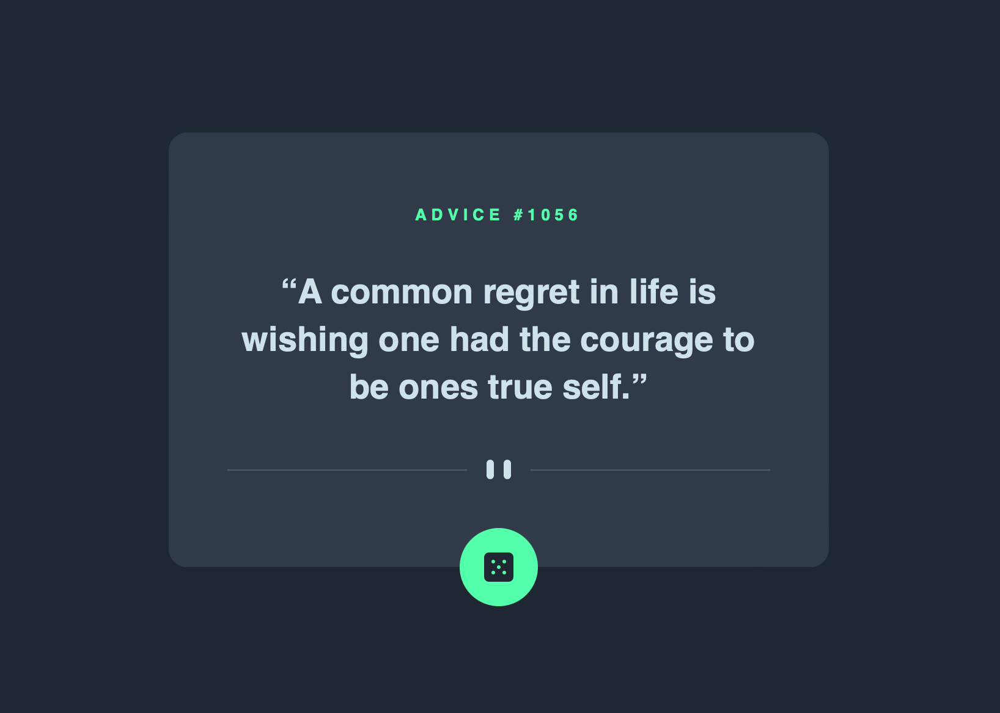

<div align="center">
  
</div>

## Table of contents

- [Overview](#overview)
  - [The challenge](#the-challenge)
  - [Links](#links)
- [My process](#my-process)
  - [Built with](#built-with)
  - [What I learned](#what-i-learned)
  - [Continued development](#continued-development)
  - [Useful resources](#useful-resources)
- [Author](#author)

## Overview

This is a solution to the [Advice generator app challenge on Frontend Mentor](https://www.frontendmentor.io/challenges/advice-generator-app-QdUG-13db).

### The challenge

Users should be able to:

- View the optimal layout for the app depending on their device's screen size
- See hover states for all interactive elements on the page
- Generate a new piece of advice by clicking the dice icon

<div align="center">
  
  <p><em>Hover state design</em></p>
</div>

### Links

- Solution URL: [Advice generator app](https://rileydevdzn.github.io/advice-generator-app/)

## My process

### Built with

- Semantic HTML5 markup
- CSS variables, functions, Flexbox
- JavaScript random number generator
- JavaScript 3rd party APIs, interacting with [Advice Slip API](https://api.adviceslip.com/) to generate random quotes of advice
- Realistic workflow, building from professional Figma design files (design-to-code) 

### What I learned

Initially, I created a simple iterative counter to dynamically update the advice number with each click. To add some interest and make the app more realistic, I replaced the iterative counter with a random number generator I created in JavaScript using the Math.floor() and Math.random() methods, to generate a random integer within a specified min and max inclusive range.
```js
let minCount = 1;
let maxCount = 2000;

function genRandomCount() {
  let randomCount = Math.floor(Math.random() * (maxCount - minCount + 1)) + minCount;
  return randomCount;
}
``` 

While testing my app on different browsers, I discovered the hover state persisted when the button was clicked on Firefox and Chrome. Digging into my code, I figured out that my `:focus` pseudo-class was the issue when my button fired the JavaScript. 

Not wanting to reduce accessibility, I did some research and chose to use `:focus-visible` instead. This keeps the button accessibile to keyboard users while resolving the persistent styling on click from `:focus`.

Working with `fetch()` and the Advice Slip API took some trial and error to generate the desired result and I learned a lot along the way.

### Continued development

This was my first time using a 3rd party API with JavaScript and I found the project very rewarding. I'm continuing to work on improving my JavaScript skills and I plan to do more research on accessibility to find ways to make my builds more accessible for all users. 

### Useful resources

- [Using the Fetch API](https://developer.mozilla.org/en-US/docs/Web/API/Fetch_API/Using_Fetch) - MDN guide to using JS fetch()

## Author

- Frontend Mentor - [@rileydevdzn](https://www.frontendmentor.io/profile/rileydevdzn)
